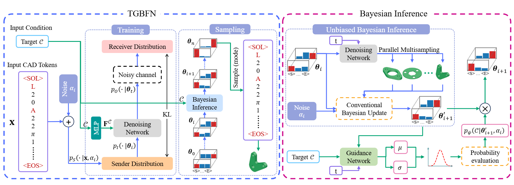

# 🧩 Target-Guided Bayesian Flow Networks for Quantitatively Constrained CAD Generation (TGBFN)

[](https://your-paper-link.com)
[](https://www.python.org/downloads/release/python-390/)

This repository contains the official implementation of our **ACM MM 2025** paper:

> **Target-Guided Bayesian Flow Networks for Quantitatively Constrained CAD Generation**

We propose a novel generative framework, **TGBFN**, which enables **precise, constraint-aware parametric CAD sequence generation** under quantitative targets such as surface area and volume. This is the first framework that enables **differentiable Bayesian flow** over discrete-continuous hybrid spaces for CAD design.

---

<p align="center">
  
  <br>
  <em><strong>Figure:</strong> Overview of the proposed Target-Guided Bayesian Flow Network (TGBFN).</em>
</p>

---

## 🔧 Features

- ✅ **Target-conditioned generative modeling** for CAD sequences  
- ✅ **Unbiased Bayesian inference** with parallel multi-sample updates  
- ✅ **Guided Bayesian flow** with theoretical factorization  
- ✅ **Statistical fidelity via calibrated distribution estimation**  

---

## 📂 Project Structure

```
TGBFN/
├── networks/             # Model definitions for the skeleton network (φ) and guidance network (ψ)
├── configs/              # YAML configuration files for training and inference
├── test.py               # Script for testing CAD generation under target constraints
├── env.yaml              # Conda environment specification
```

---

## 🚀 Getting Started

### 1. Environment Setup

```bash
git clone ...
cd tgbfn
conda env create -f env.yaml
conda activate tgbfn
```

### 2. Dataset

We release a numerically annotated CAD dataset built upon DeepCAD, enhanced with precise surface area and volume labels. These geometric properties are computed from boundary representation (B-Rep) models using the [PythonOCC](https://github.com/tpaviot/pythonocc-core) engine.

This dataset enables both **single-property** (surface area or volume) and **multi-property** (area + volume) conditioned generation, making it suitable for training and evaluating quantitatively constrained CAD generative models.

📥 Download the dataset here: [data_of_TGBFN](https://drive.google.com/file/d/108KFFH0nDJsnypfZ9NKr08orWBBjV-n-/view?usp=sharing)

### 3. Train

**Stage 1: Train Skeleton Network**

```bash
python train.py meta.wandb_project="new_project_name" data.data_root=./data
```

**Stage 2: Train Conditional Guidance**

```bash
python train_guidance.py meta.wandb_project="new_project_name" data.data_root=./data/Sample_data_alpha200
```

### 4. Test

```bash
python test.py load_model="./checkpoints/BFN/last/ema_model.pt" guided_model="./checkpoints/GBF/last/ema_model.pt"
```

---

## 📜 Citation

If you find our work helpful, please consider citing:

```bibtex

```

---

## 📝 License

This project is licensed under the MIT License. See [LICENSE](./LICENSE) for details.

---

### 🙏 Acknowledgements

This repository is built upon the codebase of [**Bayesian Flow Networks**](https://github.com/nnaisense/bayesian-flow-networks). We thank the authors for their open-source contributions.

---

## 💬 Contact

For questions or collaborations, feel free to open an issue or contact [zhengwenhao@stu.scu.edu.cn](mailto:zhengwenhao@stu.scu.edu.cn).
